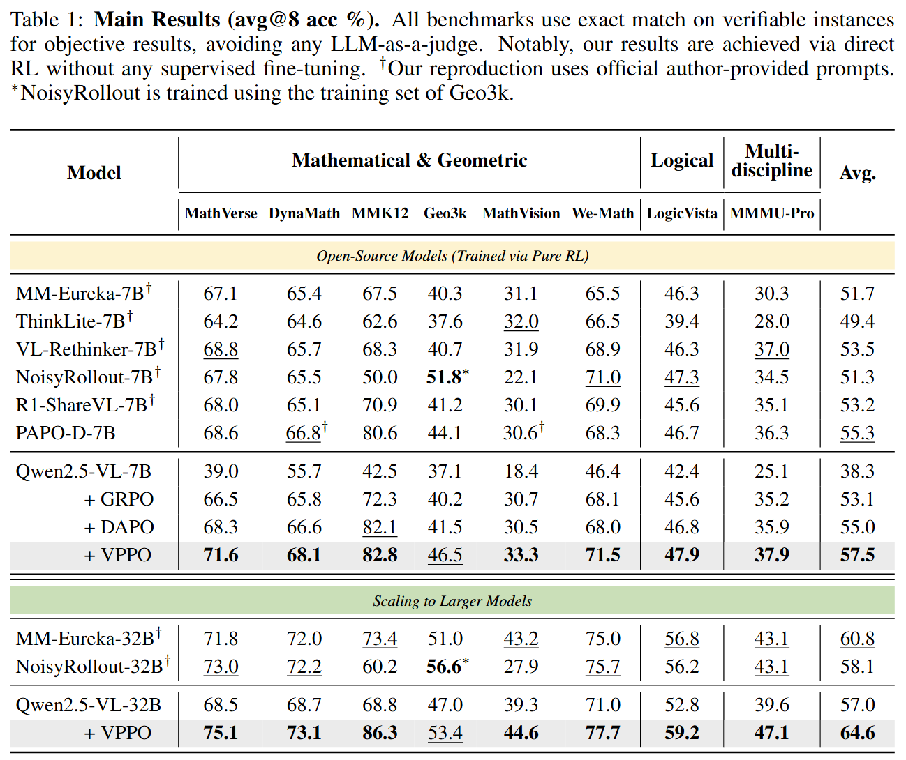

<div align="center">

# Spotlight on Token Perception for Multimodal Reinforcement Learning

</div>

<div align="center">

[](https://arxiv.org/abs/2510.09285)
[](https://github.com/huaixuheqing/VPPO-RL)
[](https://huggingface.co/papers/2510.09285)
[](https://huggingface.co/collections/chamber111/vppo-model-68e79d724ad79e69c6f60d58)
[](https://huggingface.co/collections/chamber111/vppo-data-68e7aaafe1bffbab844d341b)

</div>

This repository contains the official implementation of our work, which introduces a new paradigm for training large vision-language models. We argue that the key to unlocking advanced multimodal reasoning lies in moving beyond uniform, coarse learning signals and instead putting a **spotlight on token-level visual perception**.

Our proposed algorithm, **Visually-Perceptive Policy Optimization (VPPO)**, is the first to directly implement this principle. It intelligently focuses policy updates on the critical moments of visually-grounded reasoning, leading to state-of-the-art performance, superior training efficiency, and a more robust learning process.

---

## 🎯 The Core Insight: Not All Tokens Are Created Equal

Standard reinforcement learning methods for LVLMs suffer from a fundamental flaw: they treat every token in a generated response as equally important. A single reward is broadcast indiscriminately, rewarding generic phrases just as much as the critical step where the model *perceives a key detail* from the image.

Our analysis reveals two key truths about multimodal reasoning:

1.  **Token visual dependency is sparse:** Only a small fraction of tokens in a reasoning chain are highly dependent on the visual input. These are the pivotal moments of visually-grounded reasoning.
2.  **Trajectory visual dependency is heterogeneous:** Not all correct solutions are equal. Some are robustly grounded in visual evidence, while others are "lucky guesses" based on linguistic priors.

<p align="center">
  
  &nbsp; <!-- 图片之间的空格 -->
  
</p>
<p align="center">
  <em>Left: Most tokens have low visual dependency. Right: Trajectories show a wide range of visual dependency. Standard RL treats them all the same.</em>
</p>

This misalignment causes **signal dilution**, slowing down learning and preventing models from developing genuine multimodal perception and reasoning skills.

## ✨ Our Solution: Visually-Perceptive Policy Optimization (VPPO)

VPPO is a novel policy gradient algorithm designed to solve this problem by reshaping the learning signal at two levels of granularity:

<div align="center">

</div>

1.  **Macro-Level 🎯 Trajectory Advantage Shaping (TAS):** We re-weight the advantage of each trajectory based on its average visual dependency. This prioritizes learning from robust, perception-grounded reasoning paths.

2.  **Micro-Level 🔦 Token Gradient Filtering (TGF):** We construct a sparse gradient mask to focus policy updates *exclusively* on the top-k% most visually-dependent tokens. This puts a "spotlight" on what truly matters, reducing gradient variance and leading to more stable and effective training.

## 🏆 Performance Highlights

By focusing the learning signal, VPPO establishes a new state-of-the-art across 8 challenging multimodal reasoning benchmarks.

#### State-of-the-Art Accuracy

<div align="center">

</div>

#### Faster Convergence & Superior Stability

VPPO not only achieves a higher final performance but gets there faster and more reliably.

<div align="center">

</div>

## 🚀 Getting Started

### 1. Recommended Environment

-   Python 3.10
-   PyTorch 2.6
-   CUDA 12.4

### 2. Environment Setup

```bash
# Create and activate a conda environment
conda create -n vppo python=3.10
conda activate vppo

# Clone the repository
git clone https://github.com/huaixuheqing/VPPO-RL
cd VPPO-RL

# Install dependencies
pip install -e .
```

### 3. Training with VPPO

The training pipeline is adapted from [EasyR1](https://github.com/hiyouga/EasyR1). We provide example scripts for training 7B models with VPPO.

-   **Hardware for Qwen2.5-VL-7B:** 8 x H800 (80G) GPUs.
-   **Hardware for Qwen2.5-VL-32B:** 32 x H800 (80G) GPUs.

```bash
# To train the VPPO-7B model
bash examples/configs/train_vppo_7b.sh
```

### 4. Evaluation

Our evaluation leverages the framework from [PAPO-Eval](https://github.com/xhguo7/PAPO-Eval). To replicate our results, you will need to download our specific evaluation data from the [VPPO-Eval](https://huggingface.co/datasets/chamber111/VPPO-Eval) Hugging Face dataset. Please place the `data` folder from this dataset directly into your local `PAPO-Eval` repository. Once the data is in place, you can run the evaluation scripts by selecting the desired benchmark name. A complete list of available benchmark names can be found in the `data/dataset_info.json` file. All results in the paper are reported as **average accuracy@8** with an inference temperature of **1.0**.

## 📚 Datasets

### Training Data

-   **Training**: [ViRL39K](https://huggingface.co/datasets/chamber111/VPPO_ViRL39K_train)
-   **Validation**: [MMK12](https://huggingface.co/datasets/chamber111/VPPO_MMK12_validation)

### Evaluation Data

| Benchmark    | Hugging Face Link                                            | Focus Domain      |
| :----------- | :----------------------------------------------------------- | :---------------- |
| Geo3k        | [`hiyouga/geometry3k`](https://huggingface.co/datasets/hiyouga/geometry3k) | Geometric Reasoning  |
| We-Math      | [`We-Math/We-Math`](https://huggingface.co/datasets/We-Math/We-Math) | Math Reasoning |
| MMK12        | [`FanqingM/MMK12`](https://huggingface.co/datasets/FanqingM/MMK12) | Math Reasoning |
| MathVerse    | [`AI4Math/MathVerse`](https://huggingface.co/datasets/AI4Math/MathVerse) | Math Reasoning |
| MathVision   | [`MathLLMs/MathVision`](https://huggingface.co/datasets/MathLLMs/MathVision) | Math Reasoning    |
| DynaMath     | [`DynaMath/DynaMath_Sample`](https://huggingface.co/datasets/DynaMath/DynaMath_Sample) | Math Reasoning |
| LogicVista   | [`lscpku/LogicVista`](https://huggingface.co/datasets/lscpku/LogicVista) | Logical Reasoning |
| MMMU-Pro     | [`MMMU/MMMU_Pro`](https://huggingface.co/datasets/MMMU/MMMU_Pro) | Multi-discipline  |

*Note: We filter instances from `MathVerse`, `MathVision`, and `DynaMath` to ensure verifiable, exact-match evaluation. All datasets, including these filtered subsets, are publicly available on our [Hugging Face](https://huggingface.co/collections/chamber111/vppo-data-68e7aaafe1bffbab844d341b).*

## 📜 Citation

If you find our work on token perception and the VPPO algorithm useful in your research, please cite our paper:

```bibtex
@misc{huang2025spotlighttokenperceptionmultimodal,
      title={Spotlight on Token Perception for Multimodal Reinforcement Learning}, 
      author={Siyuan Huang and Xiaoye Qu and Yafu Li and Yun Luo and Zefeng He and Daizong Liu and Yu Cheng},
      year={2025},
      eprint={2510.09285},
      archivePrefix={arXiv},
      primaryClass={cs.CV},
      url={https://arxiv.org/abs/2510.09285}, 
}
```

## Acknowledgements

Our codebase is built upon the excellent work of [EasyR1](https://github.com/hiyouga/EasyR1). We are grateful to the original authors for their valuable contributions.
